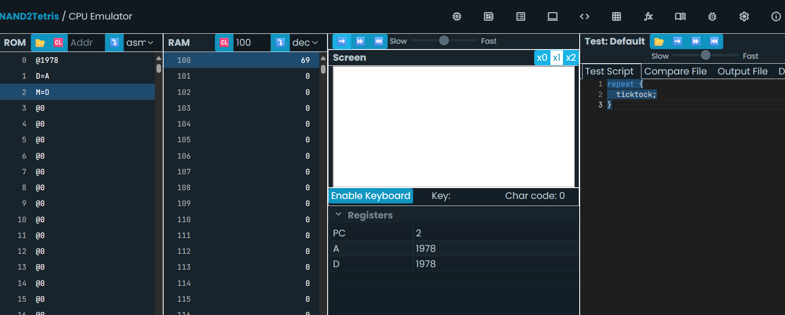
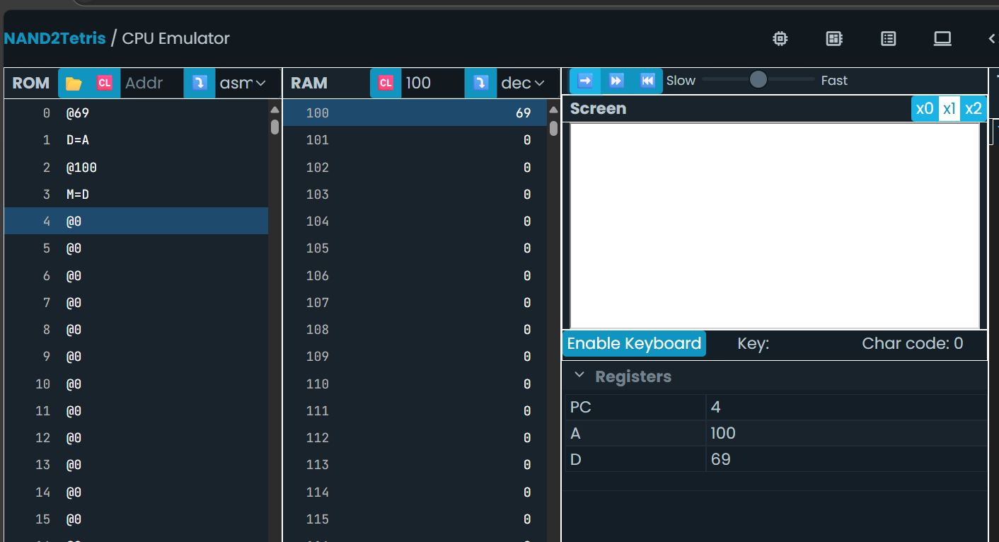
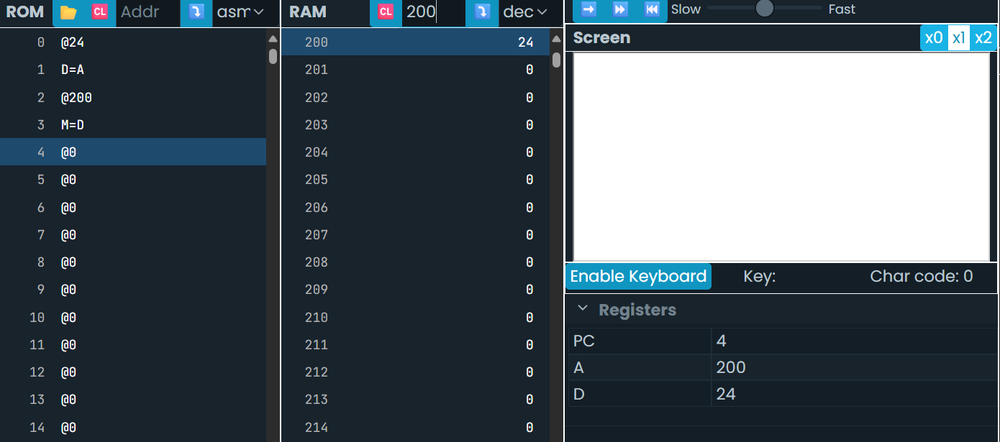
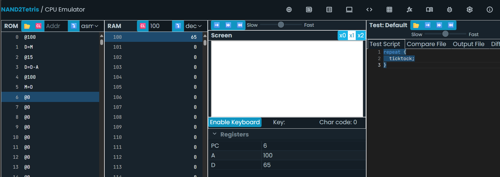
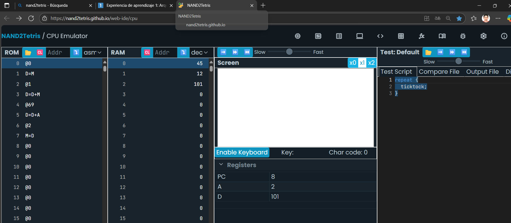
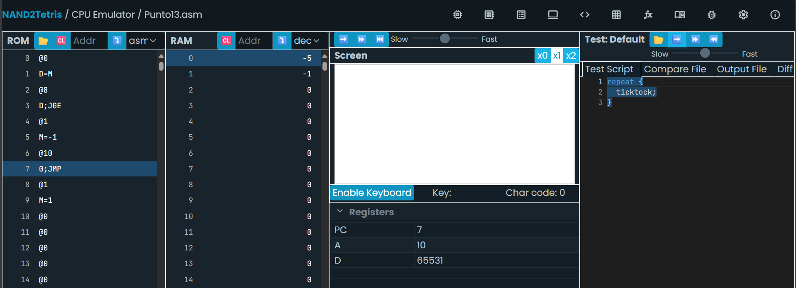
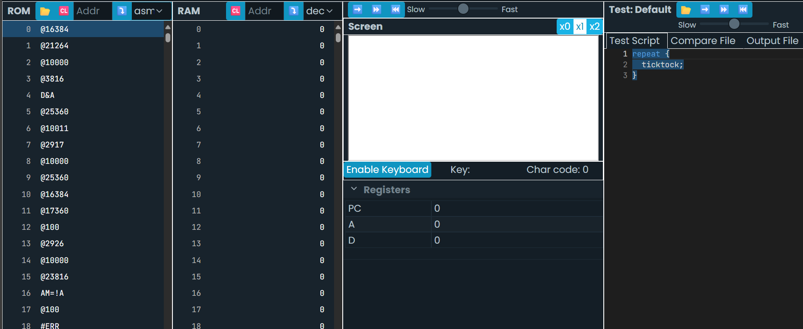

Punto 1.

punto 2.

Punto3.

Punto4.

punto5.

del punto 1 al punto 7 fue un repaso para ubicar valores en direcciones de meoria RAM y de registro.

Punto8.

punto 9.

Punto 13.

en este ejercicio se me despejo la duda de que significaba R0, en principio yo sabia que @n representaba la dirección, pero R también representa la dirección en RAM.

Punto 18.

Aqui aprendi que se los pixeles son traducidos al lenguaje ensamblador y que cada pixel de color negro es más complejo de lo que pensaba.

Punto 19.

No se pudo hacer, hubo errores que impedian la correcta interpretación del codigo. En principio la explicación de Copilot dice que se encarga de detectar la letra "D" pero no me dice el proposito especifico, dice que siguie patrones en la pantalla y se encarga de dibujar.