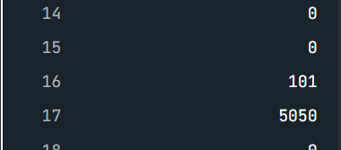
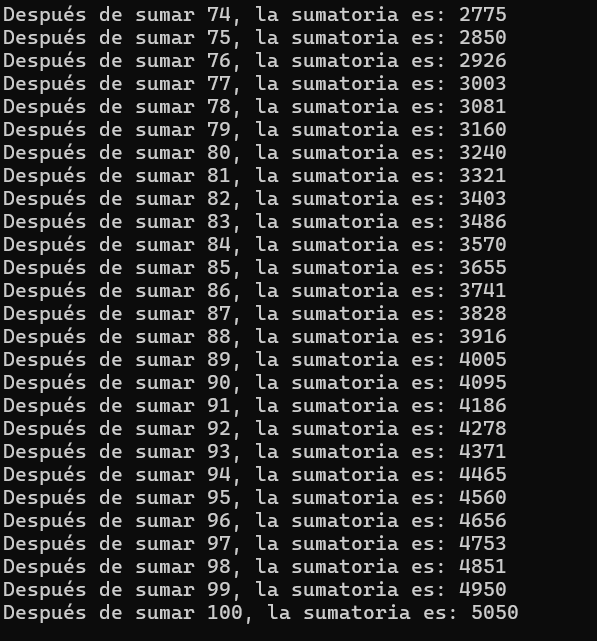
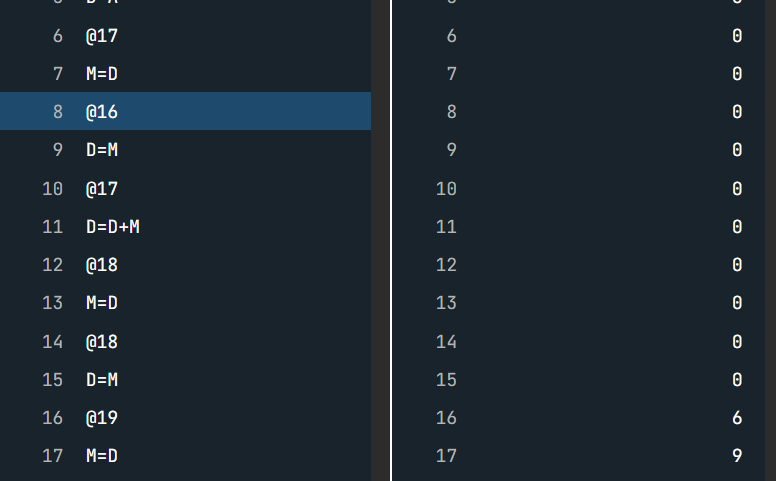

### Punto 1


- ¿Cómo están implementadas las variables `i` y `sum`?

  R// la variable @i y @sum son las direcciones superiores a 15, tienen la función de almacenar los valores de la sumatoria @i siendo el número natural y @sum el acumulado de las sumas de estos numeros.

- ¿En qué direcciones de memoria están estas variables?

  R// En este caso @i = @16 y @sum = @17
 
- ¿Cómo está implementado el ciclo `while`?

    R// Esta implementado con la condicional JGT 100 si el valor de @i es igual valor 100 el condicional acba el ciclo while.
    
- ¿Cómo se implementa la variable `i`?

   R// este es valor secuencial que se debe sumar en Suma, es decir, 1+..2+...3+...4+, este valor es la referencia que se usa para la suma.

- ¿En qué parte de la memoria se almacena la variable `i`?

  R// se guarda en @16


- Después de todo lo que has hecho, ¿Qué es entonces una variable?

  R// Una variable es un espacio de memoria RAM reservada que guarda datos.


- ¿Qué es la dirección de una variable?

  R// Es la posición de la memoria que se encuentra la variable.


- ¿Qué es el contenido de una variable? 

  R// en assembly es un número que lo identifica en una dirección de memoria.

  

  

  en este caso el loop si logra llegar a la suma maxima.

  

  si no es @100 el acumulado de la sumatoria solo llegara a 4950 porque no toma al 100 debido a la comparativa.


### Punto 2
```c#
//transformación

int sumatoria = 0;

for (int i = 1; i <= 100; i++)
{
    sumatoria += i;
    Console.WriteLine($"Después de sumar {i}, la sumatoria es: {sumatoria}"); // este es un agreado para ver el acumulado de las notas
}

```


  


### Punto 3

La diferencia en la codificación de bajo nivel es nula,s e secribe de igual manera, sin embargo en lenguajes de alto nivel como C# se deben escribir para el ciclo while o ciclo For, en el ciclo fOR se toma la variable i y se compara con el 100 hasta se suma de en una unidad y si llega a cumplir la condición acaba el ciclo. 


### Punto 4
El programa anterior modifica el contenido de la variable `var` por medio de la variable `punt`. `punt` es un puntero porque almacena la dirección de memoria de la variable `var` . En este caso el valor de la variable `var`  será 20 luego de ejecutar `*punt = 20;`. Ahora analiza:

- ¿Cómo se declara un puntero en C++? `int *punt;`. `punt` es una variable que almacenará la dirección de un variable que almacena enteros.
- ¿Cómo se define un puntero en C++? `punt = &var;`. Definir el puntero es inicializar el valor del puntero, es decir, guardar la dirección de una variable. En este caso `punt` contendrá la dirección de `var` .
- ¿Cómo se almacena en C++ la dirección de memoria de una variable? Con el operador `&`. `punt = &var;`
- ¿Cómo se escribe el contenido de la variable a la que apunta un puntero? Con el operador . `punt = 20;`. En este caso como `punt` contiene la dirección de `var`  entonces `punt` a la izquierda del igual indica que quieres actualizar el valor de la variable `var` .

### Punto 5

 


### punto 8

  - ¿Qué hace esto `int *pvar;`?

    R// este crea la variable puntero que es un entero, esta varaible debe ser asignada a un "Despuntero", es decir tiene que tener el mismo formato o no es valido.

 - ¿Qué hace esto `pvar = var;`?

   R// lo que esta guardado en Var se asigna en pvar

 - ¿Qué hace esto `var2 = *pvar`?

   R// coge la dirección del puntero y se lo incrusta a Var2.

- ¿Qué hace esto `pvar = &var3`?

   R// se asigna el puntero de var3 y se guarda.

 ### Punto 9

  El punto 9 no supe como realizarlo, no comprendo la estructura del codigo en c++ y no se por donde comenzar, usare copilot para comprender la estructura.

  A continuación estara el codigo desmenuzado y explicado.

  

  en esta parte se guarda @6 en la posición @16. En este caso @6 en c++ sería la variable **a=6**

  

  en esta parte se guarda @9 en la posición @1. En este caso @9 en c++ sería la variable **b=9**

  

  Esta parte es extensa se simula el @var, aqui es donde se va a guardar la sumatoria entre 6 y 9 se guardara en la posición @18 que es @var. Luego el valor de la suma es guardado en @c que esta en la dirección @19. 
  


