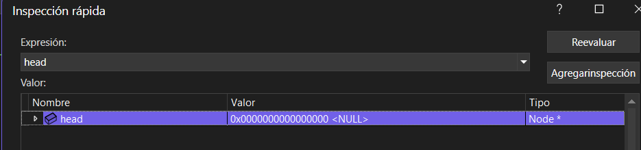
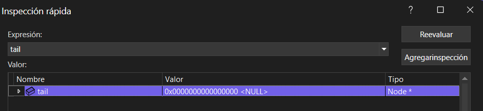
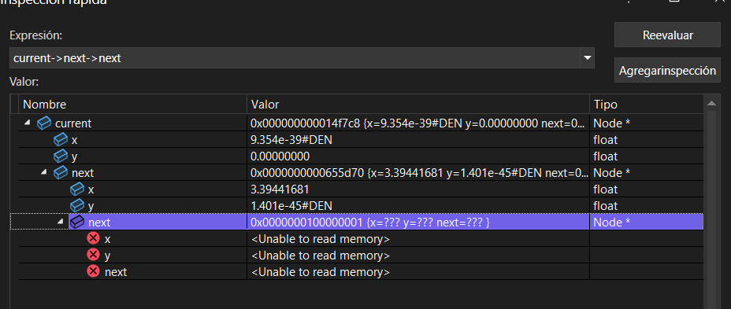
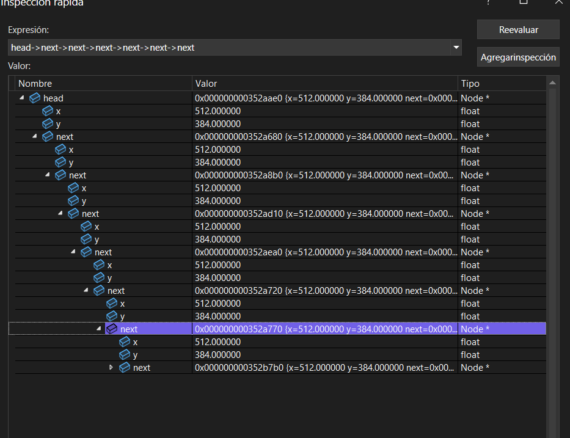
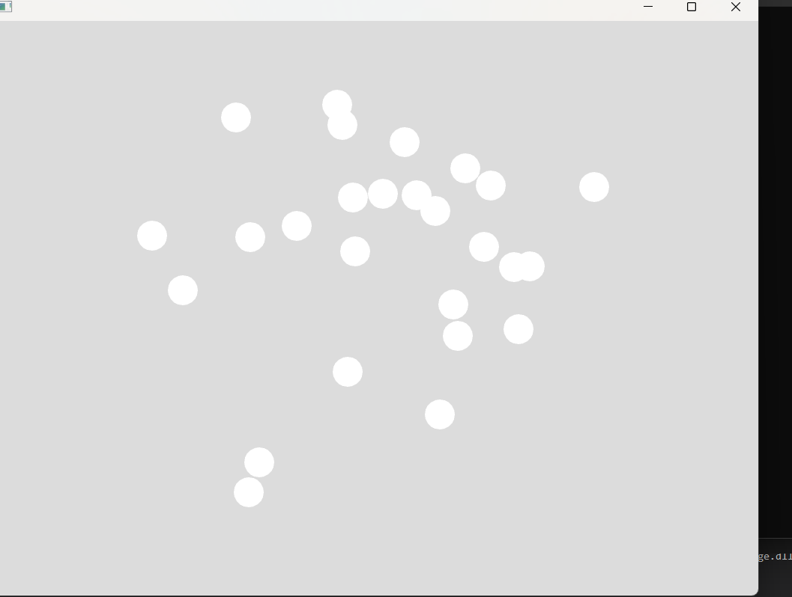

## Investigación

### Actividad 1

1. **Entiende la aplicación**: comienza explorando detenidamente cómo funciona el programa. Usa un un modelo del lenguaje como ChatGPT y el depurador para que verifiques las explicaciones que te propone ChatGPT. Puedes escribir el prompt: quiere entender de manera muy detallada el siguiente programa escrito en C++ y el openframeworks. Luego le das el código. Ve preguntando lo que no entiendas. recuerda ir usando al mismo tiempo el depurador de visual studio.

R// 

```c++
class Node {
public:
    float x, y;
    Node* next;

    Node(float _x, float _y);
    ~Node();
};
```

Se define la clase nodo, el puntero (Node*) contiene la posición, los nodos individuales en está clase se convierten en listas enlazadas. Por ultimo se encuentra el destructor.


```c++
class LinkedList {
private:
    Node* head;
    Node* tail;
    int size;

public:
    LinkedList();
    ~LinkedList();
    void addNode(float x, float y);
    void update(float x, float y);
    void display();
    void clear();
};
```
**Private:**
 Head y tail tienen acceso inmediato al inicio y final de la lista, es decir, head tiene acceso inmediato al inicio, si no estuviera el Tail, se deberan recorrer todos los nodos iniciando en Head. Size mantiene el conteo de nodos creados.

**Public:**
Dentro se encuentra el constructor de la lista **LinkedList** inicializando head, tail y el conteo de size. **~LinkedList** es el destructor, encargado de liberar la memoria y evitar fugas, **Update** recorre la lista actualizando la posición de los nodos anteriores. **display** dibuja los nodos recorriendo la lista de los nodos. **clear** recorre desde *Head* liberando cada nodo con el *delete* y reinicia sus valores.


**ubicaciones de memoria de las listas:**+		



- head	0x0000000000000000 <NULL>	Node *



- tail	0x0000000000000000 <NULL>	Node *

Se puede observar que ambos están apuntando al Nullprint, lo que significa **La lista esta vacia**



- Es un puntero a un nodo (Node*).
- Apunta a la dirección de memoria 0x000000000014f7c8




- Es un puntero al primer nodo de la lista.
- Apunta a la dirección 0x000000000352aae0, que contiene un nodo válido.
- x=512.000000, y=384.000000 Son las coordenadas del primer nodo.


2. **Realiza evaluaciones formativas**. Dile a ChatGPT que te genere preguntas para verificar si entiendes cómo funciona el programa. Trata de verificar tus hipótesis usando el depurador y luego con las conclusiones del experimento responde la pregunta de ChatGPT. Continúa con este proceso hasta que estés seguro de que entiendes cómo funciona el programa.

R// 1. ¿Qué condiciones indican que un nodo está correctamente encadenado en la lista?
Selecciona todas las que apliquen:
- [ ] Su puntero next es distinto de nullptr.
- [ ] Su dirección de memoria es igual a la de head.
- [ ] Su puntero next apunta a una dirección válida.
- [ ] Su valor x es mayor que cero.
💡 Usa inspección rápida para verificar si next apunta a otro nodo válido.


2. ¿Qué efectos observas al ejecutar clear() en la lista?
Selecciona todas las que apliquen:
- [ ] head y tail se vuelven nullptr.
- [ ] Todos los nodos se eliminan de memoria.
- [ ] El valor de size se reinicia a 0.
- [ ] Se dibujan los nodos en pantalla como círculos negros.
💡 Coloca un breakpoint en clear() y observa los cambios en head, tail, y size.


3. ¿Qué valores esperas ver en el depurador si la lista está vacía?
Selecciona todas las que apliquen:
- [ ] head == nullptr
- [ ] tail == nullptr
- [ ] size == 0
- [ ] head->next apunta a tail
💡 Verifica esto justo después de presionar la tecla 'c' que llama a clear().


4. ¿Qué observas en los nodos cuando se llama a update()?
Selecciona todas las que apliquen:
- [ ] El primer nodo toma la posición del mouse.
- [ ] Cada nodo copia la posición del nodo anterior.
- [ ] El último nodo mantiene su posición original.
- [ ] Todos los nodos se eliminan.
💡 Coloca un breakpoint en update() y observa cómo cambian x e y en cada nodo.


5. ¿Qué condiciones indican que un nodo es el último en la lista?
Selecciona todas las que apliquen:
- [ ] Su puntero next es nullptr.
- [ ] Su dirección de memoria coincide con tail.
- [ ] Su valor x es igual al del nodo anterior.
- [ ] Su puntero next apunta a head.

**Respuestas** 

1.) C
2.) C
3.) A
4.) B
5.) A


✅ 1.) ¿Qué indica que un nodo está correctamente encadenado?
Tu respuesta: C → “Que su puntero next apunta a otro nodo válido”
✔ Correcto.
- En el depurador, si inspeccionas head->next y ves una dirección válida (no nullptr), el nodo está encadenado.
- Esto es lo que define la estructura de una lista enlazada.

✅ 2.) ¿Qué sucede cuando se llama a clear()?
Tu respuesta: C → “Se eliminan todos los nodos y se reinicia la lista”
✔ Correcto.
- En el depurador, después de ejecutar clear(), head y tail se vuelven nullptr, y size se reinicia a 0.
- Puedes verificar que los nodos ya no existen en memoria.

✅ 3.) ¿Qué valor esperas ver si la lista está vacía?
Tu respuesta: A → “head == nullptr”
✔ Correcto.
- Aunque la opción ideal sería “head y tail son nullptr”, tu respuesta es técnicamente válida.
- En el depurador, si head == nullptr, no hay nodos activos.

✅ 4.) ¿Qué observas en los nodos cuando se llama a update()?
Tu respuesta: B → “Cada nodo copia la posición del nodo anterior”
✔ Correcto.
- En el código, update() propaga la posición del mouse desde head hacia los demás nodos.
- Puedes ver cómo x e y cambian en cascada en el depurador.

✅ 5.) ¿Qué indica que un nodo es el último en la lista?
Tu respuesta: A → “Su puntero next es nullptr”
✔ Correcto.
- En el depurador, si inspeccionas tail->next y ves nullptr, ese nodo es el último.
- Esto es una propiedad estructural de las listas enlazadas simples.

🧠 Conclusión
Tu razonamiento está alineado con el comportamiento real del programa y con lo que se puede verificar en el depurador. Has demostrado comprensión estructural, semántica y de ciclo de vida de los nodos.


3. ¿Qué es una lista enlazada y en qué se diferencia de un arreglo en cuanto a la forma en que los elementos están almacenados en la memoria?

R// Es una estructura de datos **Dinámica** compuesta de nodos, se guarda la siguiente información: coordenadas en (X,Y) y un puntero que apunta al siguiente dodno **next**. 

**Diferencias:**

nodos:
- los nodos pueden estar ubicados en cualquier parte.
- Siguen una secuencia con un puntero *Next
- Se pueden crear en cualquier parte sin importar si al incio o al final.
- Crece o decrece en tiempo real.
- se puede crear con un new o delete
- Se puede eliminar un nodo sin importar su posición.


Arreglos: 

- Los dato se guardan en fila.
- Se guardan poniendo el indice del array.
- Su creación es fija si no se coloca un vector. 
- es estático.


4. Al observar el código de una lista enlazada en C++, ¿Cómo crees que se vinculan los nodos entre sí? ¿Qué estructura se utiliza para lograr esta conexión?

R// los nodos se crean mediante un puntero, en este ejercicio el puntero es *Next, este nodo se encarga de revisar secuencialmente los nodos formando una cadena. Cuando la secuencia se acaba apunta a un Null. Parece ser que los nodos saben donde esta el siguiente, pero no saben donde esta el anterior. 

Para ser conectados se debe expresar explicitamente una cabeza y una cola, ademas de crear una lista enlazada. Dentro de la lista se gestiona y se organiza el encadenamiento de los nodos.


5. ¿Cómo se gestiona la memoria en una lista enlazada? Investiga cómo se crea y se destruye un nodo en memoria utilizando el operador new y delete en C++.

R// Al momento de agregar un nodo a la lista, se utiliza el operador new para reservar espacio en el heap:

- Esto asigna memoria suficiente para un objeto Node.
- Devuelve un puntero a esa región de memoria.
- El nodo permanece activo hasta que se libere explícitamente con delete.

Para eliminar un nodo se llama a una función Clear(), se encarga de recorrer la lista y de eliminar cada nodo manualmente:

- delete  libera la memoria ocupada por el nodo.
- Esto devuelve el espacio al sistema operativo.
- Es esencial para evitar fugas de memoria (memory leaks).


6. Considerando la estructura de una lista enlazada, ¿qué ventajas ofrece en comparación con un arreglo cuando se trata de insertar o eliminar elementos en posiciones intermedias?

R// 
Lista enlazada
- Cada nodo se almacena en una posición independiente de memoria.
- Los nodos se conectan mediante punteros (next).
- Inserciones y eliminaciones en cualquier parte son eficientes si tienes el nodo anterior.
- El tamaño es dinámico: puedes agregar o quitar nodos sin redimensionar.
- El acceso es secuencial: debes recorrer desde el inicio para llegar a un nodo específico.
- Puede haber fragmentación en memoria, ya que los nodos están dispersos.
- Requiere gestión manual de memoria con new y delete.

 Arreglo
- Todos los elementos están en posiciones contiguas de memoria.
- No hay punteros entre elementos; se accede por índice.
- Inserciones y eliminaciones intermedias requieren mover elementos (costosas).
- El tamaño es fijo al momento de creación (a menos que uses estructuras dinámicas como std::vector).
- El acceso es directo: puedes ir al elemento i en tiempo constante.
- No hay fragmentación: todo está en un bloque continuo.
- La gestión de memoria puede ser automática (si es estático) o controlada (si usas new[]).


7. En el código presentado, ¿Cómo se asegura que no haya fugas de memoria? ¿Qué papel juega el destructor en la clase LinkedList?

R// La gestión de memoria se encuentra en la clase LinkedList(), el destructor de LinkedList se asegura de recorrer toda la lista y eliminar cada nodo antes de que el objeto sea destruido.

```c++
~LinkedList() {
    clear();


```
dentro de clear() ocurre lo siguiente:
- Se recorre la lista desde head.
- En cada iteración, se guarda el nodo actual, se avanza al siguiente, y se elimina el nodo guardado con delete.
- Al final, se reinician head, tail y size para dejar la lista en estado limpio.
Este patrón garantiza que cada nodo creado con new sea destruido con delete, cumpliendo con la regla fundamental de gestión de memoria en C++: cada new debe tener un delete.


8. ¿Qué sucede en la memoria cuando se invoca el método clear() en una lista enlazada? Explica paso a paso cómo se liberan los recursos.

R// 1. Inicio del recorrido
- Se declara un puntero auxiliar, por ejemplo current, que apunta al primer nodo (head).
- Este puntero se usará para recorrer la lista sin perder la referencia a los nodos.

2. Iteración nodo por nodo
- Mientras current no sea nullptr, se hace lo siguiente:
- Se guarda el nodo actual en un puntero temporal (temp).
- Se avanza current al siguiente nodo (current = current->next).
- Se elimina el nodo guardado con delete.
Esto libera la memoria ocupada por ese nodo en el heap. El sistema operativo recupera ese bloque.

3. Actualización de punteros
- Una vez que todos los nodos han sido eliminados:
- head se establece en nullptr.
- tail también se establece en nullptr.
- size se reinicia a 0.
Esto deja la lista en estado limpio, sin referencias a memoria dinámica.


 ¿Qué sucede en el heap?
- Cada nodo creado con new tiene una dirección única en el heap.
- Al eliminarlo con delete, esa dirección se libera.
- Si no se ejecutara delete, esos bloques quedarían ocupados, generando fugas de memoria.


9. Explica cómo cambia la estructura en memoria de una lista enlazada al agregar un nuevo nodo al final de la lista. ¿Cómo afecta esto al rendimiento de la lista enlazada?

R// Los cambios ocurridos dentro del programa se evidencian de la siguiente forma, con el new se reserva un bloque de momemoria en el heap, siendo independiente de los demas nodos. Luego se actualiza el puntero *next que antes miraba a la cola, pasando a ver el nuevo nodo. Este ultimo nodo pasa a ser el ultimo de la lista. La variable size aumenta su contador.

Ventaja: 

- No necesita recorrer toda la lista para insertar el nuevo nodo en la nueva ubicación, unicamente agrega el nuevo nodo y actualiza el puntero y el tail. No hay reubicación de datos de memoria, ni copia de bloques de memoria y tampoco se desplazan los datos. 

Desventajas: 

- La busqueda de la ubicación es lenta, debe empezar desde el head hasta llegar donde quiere agregar el nuevo nodo.
- Se debe crear con un new, lo que significa que usa espacios de memoria en el heap 
- Si no se libera el nodo puede causar figas de memoria.


10. Analiza una situación en la que utilizar una lista enlazada sería más ventajoso que utilizar un arreglo. Justifica tu respuesta considerando la gestión de memoria y las operaciones de inserción y eliminación.

R// Un puede ser el historial de busqueda, es un buen ejemplo porque se puede navegar entre nodos, que serian los sitios web y eliman los nodos seria eliminar la referencia. Usando la lista enlazada es más sencillo ingresar una nueva referencia sin tener que desplazar alguna otra referencia como ocurriría con un arreglo. Para eliminar solo se libera ese espacio de memoria sin tener que compactar el conjunto y permite la eliminación especifica sin tener que recorrer toda la lista. 


11. Después de estudiar el manejo de memoria en listas enlazadas, ¿Cómo aplicarías este conocimiento para diseñar una estructura de datos personalizada para una aplicación creativa? ¿Qué aspectos considerarías para asegurar la eficiencia y evitar fugas de memoria?

R// por ejemplo para simular un pincel y sus trazos, el pincel sería el movimiento del mouse, entonces los nodos representarian los trazos y cada que se dezplaza el mouse se crea un nuevo nodo en la posición anterior, entonces se usaría el *next para actualizar el tail y el head al agregar un nuevo nodo cuando se llegue al final del trazo este apuntara al null.

Para optimizar y evitar fugas de memoria sería limitar la cantidad de trazoz, limitando los nodos, el ultimo nodo se elimina al llegar al limite. 


12. Reflexiona sobre las diferencias en la gestión de memoria entre C++ y un lenguaje con recolección de basura automática como C#. ¿Qué ventajas y desafíos encuentras en la gestión explícita de memoria en C++ al trabajar con estructuras de datos?

R// ventajas: 
- Manualmente se puede liberar la memoria en el momento deseado.
- Es util para programas que se actualizan en tiempo real.
- Permite optimizar las listas y mejorar el rendimiento.
- no se interrumpe la ejecución al momento de recolectar los datos basura.

Complciaciones: 
- pueden haber fugas de memoria si no se libera la memoria.
- si se libera un nodo y se vuelve acceder a esa posición pueden ocurrir errores. Esto sucede porque el puntero sigue apuntando a esa posición a pesar de que esta vacia, esto se denomina puntero colgante.


13. Imagina que estás optimizando una pieza de arte generativo que usa listas enlazadas para representar elementos en movimiento. ¿Qué consideraciones tomarías en cuenta para garantizar que la gestión de la memoria sea eficiente y que no ocurran fugas de memoria?

R// Primero se debe tomar en cuenta que para crear cada particula se debe crear con el new, loq ue asigna un espacio en el heap, esto se debe tomar en cuenta para evitar fugas de memoria. Estos deben ser eliminados ya sea manualmente o al finalizar, utilizando la clase clear() encargada de recorrer los nodos y borrarlos.


14. **Pruebas:** pregunta a ChatGPT cómo podrías probar las partes del programa y el programa completo. Luego realiza las pruebas y verifica si los resultados coinciden con tus expectativas.

R// **propuesta de copilot:**

1. Pruebas unitarias por componente
🔹 Node constructor y destructor
- Prueba: Crear un nodo con valores conocidos y verificar que almacena correctamente x, y, y que next == nullptr.
- Verificación: Imprimir los valores al crear y destruir el nodo.
Node* testNode = new Node(100, 200);
ofLog() << "x: " << testNode->x << ", y: " << testNode->y << ", next: " << testNode->next;
delete testNode;


🔹 LinkedList::addNode()
- Prueba: Agregar varios nodos y verificar que tail apunta al último, y que los enlaces next son correctos.
- Verificación: Recorrer la lista e imprimir cada nodo.
snake.addNode(10, 10);
snake.addNode(20, 20);
snake.addNode(30, 30);
snake.display(); // Visual + log


🔹 LinkedList::update()
- Prueba: Simular movimiento del cursor y verificar que los nodos se actualizan en cadena.
- Verificación: Imprimir las posiciones antes y después de update(x, y).
🔹 LinkedList::clear()
- Prueba: Llenar la lista, invocar clear(), y verificar que head == nullptr, tail == nullptr, size == 0.
- Verificación: Imprimir estado antes y después de limpiar.


La imagen muestra que la posición de los nodos cambian con respecto al movimiento del mouse. Este resultado es el esperado a la prueba parcial del codigo del snake.


🧪 2. Prueba del programa completo
🔹 Flujo esperado
- Al iniciar, se crean 10 nodos en el centro de la pantalla.
- Al mover el mouse, los nodos se actualizan en cadena.
- Al presionar 'c', la lista se limpia completamente.
- En cada frame, los nodos se dibujan como círculos rojos.
🔹 Verificación visual
- ¿Los círculos siguen el cursor en forma de serpiente?
- ¿Desaparecen al presionar 'c'?
- ¿Se reconstruyen correctamente si se reinicia?
🔹 Verificación por log
Agrega trazas en cada método:
ofLog() << "Nodo agregado en: " << x << ", " << y;
ofLog() << "Actualizando nodo: " << current->x << ", " << current->y;
ofLog() << "Limpiando nodo en: " << current->x << ", " << current->y;


✅ Resultados esperados
|  |  |  | 
| setup() |  | size == 10head != nullptr | 
| update(mouseX, Y) |  |  | 
| draw() |  |  | 
| keyPressed('c') |  | size == 0head == nullptr | 


2. Prueba del programa completo
🔹 Flujo esperado
- Al iniciar, se crean 10 nodos en el centro de la pantalla.
- Al mover el mouse, los nodos se actualizan en cadena.
- Al presionar 'c', la lista se limpia completamente.
- En cada frame, los nodos se dibujan como círculos rojos.
🔹 Verificación visual
- ¿Los círculos siguen el cursor en forma de serpiente?
- ¿Desaparecen al presionar 'c'?
- ¿Se reconstruyen correctamente si se reinicia?


 https://youtu.be/5DUoUUUbgAQ


### Actvidad 2

1. **Entendiendo la aplicación**: comienza explorando detenidamente cómo funciona el programa. Usa un un modelo del lenguaje como ChatGPT y el depurador para que verifiques las explicaciones que te propone ChatGPT. Puedes escribir el prompt: quiere entender de manera muy detallada el siguiente programa escrito en C++ y el openframeworks. Luego le das el código. Ve preguntando lo que no entiendas. recuerda ir usando al mismo tiempo el depurador de visual studio.

1. Clase Node
class Node {
public:
    ofVec2f position;
    Node* next;

    Node(float x, float y) {
        position.set(x, y);
        next = nullptr;
    }
};


- Cada nodo almacena una posición (x, y) como ofVec2f.
- El puntero next enlaza al siguiente nodo en la pila.
- Al crear un nodo, se inicializa con una posición y next = nullptr.
 su destrucción depende de la clase Stack.

🔹 2. Clase Stack
class Stack {
public:
    Node* top;

    Stack() { top = nullptr; }
    ~Stack() { clear(); }


Métodos:
push(float x, float y)
- Crea un nuevo nodo.
- Lo enlaza como nuevo top, apuntando al anterior.
newNode->next = top;
top = newNode;


pop()
- Elimina el nodo superior.
- Libera su memoria con delete.
- Actualiza top al siguiente nodo.
clear()
- Llama repetidamente a pop() hasta que la pila esté vacía.
display()
- Recorre la pila desde top y dibuja cada nodo como un círculo.
 Esta clase gestiona explícitamente la memoria dinámica de los nodos.

 3. Clase ofApp
class ofApp : public ofBaseApp {
    Stack circleStack;
    ...
};


Métodos clave:
setup()
- Establece el color de fondo.
draw()
- Llama a circleStack.display() para dibujar los nodos.
keyPressed(int key)
- 'a': apila un nuevo nodo en la posición del mouse.
- 'd': desapila el nodo superior.


2. **Realiza evaluaciones formativas**. Dile a ChatGPT que te genere preguntas para verificar si entiendes cómo funciona el programa. Trata de verificar tus hipótesis usando el depurador y luego con las conclusiones del experimento responde la pregunta de ChatGPT. Continúa con este proceso hasta que estés seguro de que entiendes cómo funciona el programa.


Respuestas:
- 1 (B)
- 2 (C)
- 3 (A)
- 4 (D)
- 5 (D)


🧪 Cuestionario técnico de opción múltiple
1. ¿Qué ocurre cuando se presiona la tecla 'a'?
- Se borra toda la pila
- Se apila un nuevo nodo en la posición del mouse
- Se elimina el nodo superior
- Se dibuja un círculo aleatorio en pantalla
✅ Respuesta correcta: B

2. ¿Qué función se encarga de liberar toda la memoria de los nodos?
- setup()
- update()
- clear()
- display()
✅ Respuesta correcta: C

3. ¿Qué sucede si se llama a pop() cuando la pila está vacía?
- Se produce un error de segmentación
- Se crea un nuevo nodo vacío
- No ocurre nada porque se verifica si top es nullptr
- Se reinicia la pila automáticamente
✅ Respuesta correcta: C

4. ¿Cómo se dibujan los nodos en pantalla dentro del método display()?
- Como cuadrados en posiciones aleatorias
- Como texto con las coordenadas
- Como líneas conectadas entre nodos
- Como círculos en las posiciones almacenadas
✅ Respuesta correcta: D

5. ¿Qué estructura de datos se utiliza para almacenar los círculos?
- Arreglo dinámico
- Cola circular
- Lista doblemente enlazada
- Pila implementada con nodos enlazados
✅ Respuesta correcta: D


3. **Pruebas:** pregunta a ChatGPT cómo podrías probar las partes del programa y el programa completo. Luego realiza las pruebas y verifica si los resultados coinciden con tus expectativas.

R//



Los resultados completos son los esperados, se generan los circulos al presionar "a" y se borran al presionar "d", también verifique si al no haber nada ocurría algún error y es todo lo contrario. se eliminan y al llegar a 0 no hay errores

Preguntas de reflexión para el stack:

1. ¿Cómo se gestiona la memoria en una implementación manual de un stack en C++? Reflexiona sobre cómo el uso de new y delete en la creación y destrucción de nodos afecta el rendimiento y la seguridad de tu programa.

R// la creación del nodo se crea como los anteriores, se crea con un new que ocupa un espacio de memoria y para ser liberado se de usar un delet, al ser una pila, se debe eliminar desde la cabeza hasta la cola, es todo lo contrario con una lista enlazada, aqui se debe hacer en orden. Push() reserva la memoria en el heap  y pop() libera especificamente esa memoria 


2. ¿Por qué es importante liberar la memoria cuando se desapila un nodo en un stack? Considera las consecuencias de no liberar memoria en términos de fugas de memoria y cómo esto puede impactar aplicaciones de largo tiempo de ejecución.

R// Si no se libera ese espacio de memoria queda inaccesible y puede afectar al rendimiento del programa generando fugas de memoria, puede degradarse más rapido, se agota la memoria y al agotarse puede afectar al desarrollo del programa.


3. ¿Qué diferencias existen entre usar un stack de la STL (std::stack) y crear un stack manualmente? Explora cómo la abstracción que proporciona la STL puede simplificar la implementación, pero también cómo una implementación manual ofrece mayor control sobre la gestión de recursos.

R// Manual: 
- se crea con un new o delete permitiendo gestionar nodos en el momento que se deseaba. 
- Se puede usar listas entrelazadas.
- Si no se gestionan los punteros pueden ocurrir punteros colgantes.

STL: 

- Se liga a un vector.
- No requiere punteros.
- ligados a un arreglo


4. ¿Cómo afecta la estructura de un stack al orden de acceso y eliminación de elementos? Analiza cómo la naturaleza LIFO (Last In, First Out) del stack influye en los tipos de problemas que esta estructura de datos puede resolver eficientemente.

R// 
- El último elemento insertado es el primero en salir.
- No puedes acceder directamente a elementos intermedios sin recorrer desde top.
- Evaluación de expresiones (notación postfija).
- Recorrido de árboles (DFS).

En arte generativo, puedes usarlo para:
- Apilar gestos o trazos recientes.
- Revertir acciones visuales.
- Controlar capas de animación.


5. ¿Cómo podrías modificar el stack para almacenar tipos de datos más complejos (e.g., objetos con múltiples atributos) sin causar problemas de memoria? Reflexiona sobre cómo gestionar adecuadamente la memoria para objetos más complejos y cómo esto afectaría tu implementación actual.

R// 
```c++
class Node {
public:
    Gesto data;
    Node* next;

    Node(const Gesto& g) : data(g), next(nullptr) {}
};
```

Se modifica el nodo para almacenar el nuevo objeto por valor, para llamarse al destructor de manera automatica. 

```c++
struct Gesto {
    ofVec2f posicion;
    float presion;
    std::string tipo;
    ofColor color;
};

class Node {
public:
    Gesto data;
    Node* next;

    Node(const Gesto& g) : data(g), next(nullptr) {}
};

```

se modifica la clase nodo para cambiar el metodo simple de **position** por **Gesto** siendo un objeto, encapsulando multiples atributos siendo optimo.


```c++
void push(const Gesto& g) {
    Node* newNode = new Node(g);
    newNode->next = top;
    top = newNode;
}

```

Se modifica el push para recibir el pbjeto **Gesto** dando más manibrabilidad para las coordenadas dando una gama amplia de gestos. 


Preguntas de autoevaluación:

1. ¿Puedo explicar detalladamente cómo funciona el proceso de apilar y desapilar nodos en un stack, incluyendo la gestión de memoria?

R// primero, es diferente el **stack de memoria** al **stack de pila**, son cosas diferentes, la pila tiene una funcionalidad distinta, este tiene una funcionalidad LIFO (Last input First Output) se apila con un push() se podria dar la analogia que es de empujar cajas apiladas, se crea un nodo y se empuja con el push al Top, se ve así  (newNode->next = top).


2. ¿Soy capaz de identificar y corregir una fuga de memoria en una implementación de stack manual?

R// Es sencillo, se debe crear una clase clear() y un destructor que recorra la lista o la pila para eliminar ese espacio de memoria y que se libere.


3. ¿Puedo modificar el stack para que incluya una función que busque un elemento específico, sin alterar el orden de los elementos apilados?

R// Aún me es complicado y sin asistencia de IA no sabria como modificar sin generar fallos.


4. ¿Entiendo cómo la estructura LIFO del stack afecta el flujo de datos y puedo dar ejemplos de problemas que se resuelvan mejor con un stack?

R// El LIFO puedo llegar a entender su concepto, es que el ultimo nodo agregado se vuelve el primero en lanzar la información que contenga por decirlo así. 


5. ¿Puedo implementar y depurar un stack para tipos de datos más complejos, asegurándome de que no haya fugas de memoria ni errores de puntero?

R// despúes de usar el depurador considero que podría identificar la pila y su dirección de memoria, identificando si el clear() elimina correctamente que no queden punteros colgantes.


Preguntas de reflexión para la queue:

1. ¿Cómo se maneja la memoria en una implementación manual de una queue en C++? Reflexiona sobre cómo se gestionan los nodos al encolar y desencolar elementos y las implicaciones en términos de eficiencia y seguridad.

R// La memoria se gestiona manualmente usando new para crear nodos al encolar y delete para liberar memoria al desencolar. Cada nodo contiene los datos y un puntero al siguiente. Es fundamental liberar cada nodo eliminado para evitar fugas de memoria, especialmente en aplicaciones que corren por mucho tiempo. El destructor de la queue debe recorrer todos los nodos y eliminarlos para asegurar que no quede memoria ocupada innecesariamente.


2. ¿Qué desafíos específicos presenta la implementación de una queue en comparación con un stack en términos de gestión de memoria? Considera las diferencias en el manejo de punteros front y rear, y cómo estos afectan el proceso de encolado y desencolado.

R // Una queue requiere dos punteros: front (inicio) y rear (final) mientras que un stack solo necesita uno (top). Esto implica que al encolar, se debe actualizar rear y al desencolar se debe actualizar front. Si alguno de estos punteros se gestiona mal, se pueden perder referencias a nodos o provocar errores de acceso. Además, hay que tener cuidado con la condición de cola vacía, donde front y rear pueden volverse null.


3. ¿Cómo afecta la estructura FIFO (First In, First Out) de una queue a su uso en diferentes tipos de problemas? Analiza cómo la estructura FIFO influye en la resolución de problemas donde el orden de procesamiento es crucial, como en sistemas de colas de espera.

R// La estructura FIFO garantiza que el primer elemento en entrar sea el primero en salir. Esto es ideal para problemas donde el orden de llegada es importante, como en colas de atención, procesamiento de tareas, simulaciones de tráfico, o buffers de comunicación. Permite un flujo ordenado, evitando que elementos antiguos queden atrapados detrás de los nuevos.


4. ¿Cómo podrías implementar una queue circular y cuál sería su ventaja respecto a una queue lineal en términos de uso de memoria? Reflexiona sobre cómo una queue circular puede mejorar la eficiencia en ciertos contextos y qué cambios serían necesarios en la implementación.

R// Una queue se puede implementar con un arreglo fijo donde  front y rear se reinician al llegar al final. Se reutiliza el espacio disponible sin tener que mover datos, lo que mejora la eficiencia en sistemas con recursos limitados. Para implementarla, se deben controlar los índices con operaciones modulares y definir claramente cuándo la cola está llena o vacía


5. ¿Qué problemas podrían surgir si no se gestionan correctamente los punteros front y rear en una queue, y cómo podrías evitarlos? Considera posibles errores como la pérdida de referencias a nodos y cómo una gestión cuidadosa de los punteros puede prevenir estos problemas.

R// Si el front y el rear no se actualizan correctamente, pueden generar errores como nodos perdidos, lectura de memoria inválida o fallos al liberar la memoria. Para evitarlo, se debe verificar siempre si la cola está vacía antes de desencolar, actualizar los punteros en cada operación, y asegurarse de liberar correctamente los nodos eliminados. También es útil encapsular la lógica en funciones bien definidas para evitar errores humanos.
