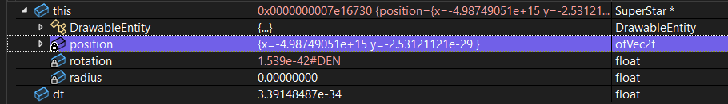
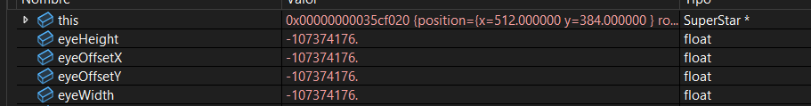
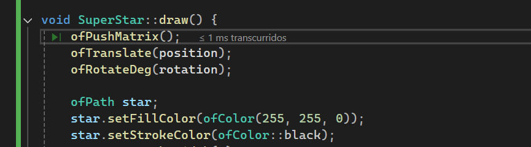
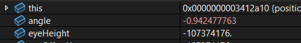

### Definición 

Para este trabajo de arte generativo busco simular la selección de un nivel de mario galaxy, este se componene de un fondo estrellado pero ene ste caso se modificara para que caigan fragmentos de estrella, son las estrellas fugaces, en el centro se encontrara la supere estrella, el comportamiento de las particulas esta dado por, una generación en el plano aleatoriamente capado a maximo 10 estrellas fugaces simultaneas, son eliminadas al momento de terminar su recorrido, la **superestrella** es la más grande y es amarilla, el comportamiento se da con su rotación horizontal.


### Comportamiento del archivo .h


1.) 

```c#
class DrawableEntity {
public:
    virtual void update(float dt) = 0;
    virtual void draw() = 0;
    virtual ~DrawableEntity() {}
};

```

Aquí se define la clase abstracta polimorfica, es decir, declara varaibles que son usadas por objetos diferentes de las clases **Draw()** y **Update()**, como se menciono previamente dentro de esta clase se define la plantilla de construcción para el resto de objetos, permitiendo crear incluso más objetos sin necesidad de modificar sustancialmente el codigo, por ejemplo, la clase void debe seguir los linemaientos del diferencial del tiempo **(dt)**. 

Se conoce como superclase o clase padre coloquilamente dicho. Por eso las subsiguientes clases pueden usar sus atributos.


2.) 


```c#

class SuperStar : public DrawableEntity {
private:
    ofVec2f position;
    float rotation;
    float radius;

public:
    SuperStar(const ofVec2f& pos);
    void update(float dt) override;
    void draw() override;
};

```

Aquí yace la subclase o clase hija coloquialmente dicho, así se denominan a las herencias, en este caso **superStar:**, la super estrella, hereda de la clase **DrawableEntity()** los atributos para ser dibujada y el como se va a comportar y la información es guardado dentro del vector **entities**. Dentro de la clase se define la posición, la rotación y el radio.

3.) 

```c#
std::vector<std::shared_ptr<DrawableEntity>> entities;
```


### Donde ocurre el encapsulamiento.

Usando la herramienta del depurador se puede visualizar el encapsulamiento.



Es interesante ver este gráfico, pero, ¿porqué? primero podemos ver que los atributos de posición, rotación y de radio son privados, **solo son accecibles desde la clase update o draw**, son las unicas que tienen los permisos para modificar, no tiene sentido modificar el comportamiento desde la misma clase.

roation ---> **1.539e-42#DEN**, este valor siginifca que la estrella se movio muy ligeramente, el significado de #DEN nos dice que es un valor muy pequeño, tan pequeño que entra en una nueva clase de valor denominada subnormal. **Son tan pequeños los valores que, pueden causar problemas de rendimiento** en maquinas que no toleren bien estos números.



El **this** no es el nombre de un atributo de hecho es un puntero oculto de los metodos no estáticos, son aquellos que no ocupan memoria. En este caso la clase superStar::Draw hace referencia al tipo **superStar**.

		eyeHeight	-107374176.	float
		eyeOffsetX	-107374176.	float
		eyeOffsetY	-107374176.	float
		eyeWidth	-107374176.	float








[ofApp] entidades activas: 1

[SuperStar] rotacion actual: 903.877

[ofApp] entidades activas: 1

[SuperStar] rotacion actual: 1280.24

[ofApp] entidades activas: 1


### Como se puede evitar el uso de punteros virtuaales.

Dnetro de nuestro codigo hacemos uso de punteros virtuales dentro de las clases superstar o fallingstar, vamos a resolvere eso.