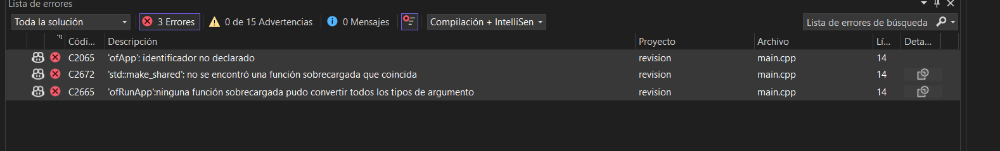
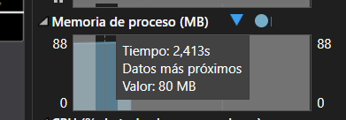
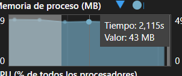

### Definición 

Para este trabajo de arte generativo busco simular la selección de un nivel de mario galaxy, este se componene de un fondo estrellado pero ene ste caso se modificara para que caigan fragmentos de estrella, son las estrellas fugaces, en el centro se encontrara la supere estrella, el comportamiento de las particulas esta dado por, una generación en el plano aleatoriamente capado a maximo 10 estrellas fugaces simultaneas, son eliminadas al momento de terminar su recorrido, la **superestrella** es la más grande y es amarilla, el comportamiento se da con su rotación horizontal.


<video controls src="video_demo.mp4" title="Title"></video>

### Comportamiento del archivo .h


1.) 

```c#
class DrawableEntity {
public:
    virtual void update(float dt) = 0;
    virtual void draw() = 0;
    virtual ~DrawableEntity() {}
};

```

Aquí se define la clase abstracta polimorfica, es decir, declara varaibles que son usadas por objetos diferentes de las clases **Draw()** y **Update()**, como se menciono previamente dentro de esta clase se define la plantilla de construcción para el resto de objetos, permitiendo crear incluso más objetos sin necesidad de modificar sustancialmente el codigo, por ejemplo, la clase void debe seguir los linemaientos del diferencial del tiempo **(dt)**. 

Se conoce como superclase o clase padre coloquilamente dicho. Por eso las subsiguientes clases pueden usar sus atributos.


2.) 


```c#

class SuperStar : public DrawableEntity {
private:
    ofVec2f position;
    float rotation;
    float radius;

public:
    SuperStar(const ofVec2f& pos);
    void update(float dt) override;
    void draw() override;
};

```

Aquí yace la subclase o clase hija coloquialmente dicho, así se denominan a las herencias, en este caso **superStar:**, la super estrella, hereda de la clase **DrawableEntity()** los atributos para ser dibujada y el como se va a comportar y la información es guardado dentro del vector **entities**. Dentro de la clase se define la posición, la rotación y el radio.

3.) 

```c#
std::vector<std::shared_ptr<DrawableEntity>> entities;
```


### Donde ocurre el encapsulamiento.

Usando la herramienta del depurador se puede visualizar el encapsulamiento.


Es interesante ver este gráfico, pero, ¿porqué? primero podemos ver que los atributos de posición, rotación y de radio son privados, **solo son accecibles desde la clase update o draw**, son las unicas que tienen los permisos para modificar, no tiene sentido modificar el comportamiento desde la misma clase.

roation ---> **1.539e-42#DEN**, este valor siginifca que la estrella se movio muy ligeramente, el significado de #DEN nos dice que es un valor muy pequeño, tan pequeño que entra en una nueva clase de valor denominada subnormal. **Son tan pequeños los valores que, pueden causar problemas de rendimiento** en maquinas que no toleren bien estos números.


El **this** no es el nombre de un atributo de hecho es un puntero oculto de los metodos no estáticos, son aquellos que no ocupan memoria. En este caso la clase superStar::Draw hace referencia al tipo **superStar**.

		eyeHeight	-107374176.	float
		eyeOffsetX	-107374176.	float
		eyeOffsetY	-107374176.	float
		eyeWidth	-107374176.	float


[ofApp] entidades activas: 1

[SuperStar] rotacion actual: 903.877

[ofApp] entidades activas: 1

[SuperStar] rotacion actual: 1280.24

[ofApp] entidades activas: 1


### Como se puede evitar el uso de punteros virtuales.

Dnetro de nuestro codigo hacemos uso de punteros virtuales dentro de las clases superstar o fallingstar, vamos a resolvere eso. La propuesta inical era usar el **CRTP** o **Patrón de Plantilla Curiosamente Recursivo** consiste en usar el poliformismo en tiempo de compilación y no de ejecución siendo mucho más eficiente para el encapsulamiento y herencia de clases. Los metodos virtuales son menos eficientes para trabajos de arte generativo, por su complejidad interna, un metodo virtual se puede decir que esta enlazada a una tabla virtual por un puntero oculto, cada vez que se quiera invocar el objeto, crearlo o instanciarlo, el puntero oculto debe apuntar al puntero virtual y este a su vez debe llegar al metodo, es muy lento y a su vez, causa que la depuración del programa se vuelva compleja. 

Si se evita el uso de metodos virtuales, se asegura la protección de los atributos privados. Sin que la superclase o clase padre tenga acceso.





### Comportamiento de memoria.








El comportamiento de la memoria al momento de cerrar su forma consume una cantidad de memoria muy diferente al momento de dibujarla, duplica el uso al momento de dibujarla, esto sucede porque sl ser dibujada, el resto de atributos como la creación de sus ojos comienzan actuar.


- ¿Cómo influyó el entendimiento de los mecanismos internos de OOP en el proyecto?

    R// Este proyecto es diferente al de los demas, anteriormente se puede decir que era más artesanal y lento, con el uso de punteros, metodos virtuales y pilas para crear partículas o cualquier otro objeto. con POO es diferente, se busca la optimización y la seguridad de los atributos para que no puedan ser modificados desde el exterior o dificultar su acceso. Su uso la herencia para la creación de objetos con una plantilla "global"

- ¿Qué desafíos enfrentaste y cómo los superaste?

    R// Primero hacer aparecer la estrella, su rtoación fue sencilla pero el hecho que se dibujara fue un reto un tanto complicado. También su optimización, para mi fue imposible el que no usara metodos virtuales, intente de todas las formas que no las usara pero al final me soltaba un error. Por ultimo, los ojos, centrarlos en la forma de la estrella fue complicado y requirío apoyo de copilot para poder lograrlo.


- ¿Qué aprendiste sobre el equilibrio entre diseño y eficiencia?

    R// Con ayuda de las herencias y el poliformismo acelera el proceso al momento de optimizar, con las herencias el hecho de poder usar atributos o metodos de una superclase ya con parametros establecidos hace que sea mucho más facil el crear nuevas instancias de objetos sin sacrificar memoria. Es como tener un gran molde para todo, puedes crear y crear y nunca habra un retraso. 