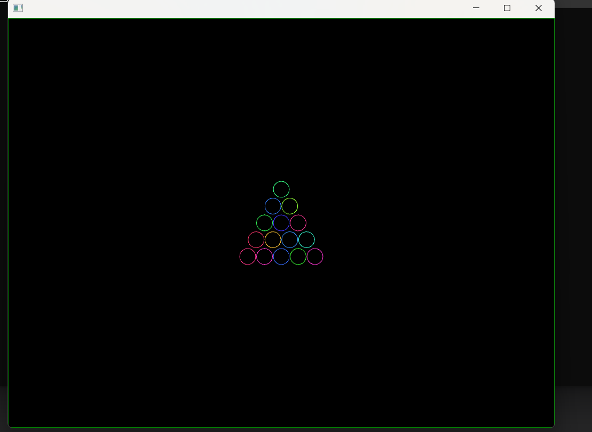

### Sesión 2


```c++
Particle* ParticleFactory::createParticle(const std::string& type) { 
	Particle* particle = new Particle(); // Crear una nueva partícula

	if (type == "star") { // Configurar propiedades específicas para una estrella
		particle->size = ofRandom(2, 4);  // Tamaño pequeño
		particle->color = ofColor(255, 0, 0); // Rojo
    }
    else if (type == "shooting_star") {
        particle->size = ofRandom(3, 6);
        particle->color = ofColor(0, 255, 0);
        particle->velocity *= 3;
    }
    else if (type == "planet") {
        particle->size = ofRandom(5, 8);
        particle->color = ofColor(0, 0, 255);
    }
    return particle;
}

```

 que cumpla la condición para que se genere la esfera.


- ¿Qué hace el patrón observer en este caso?

    R// Es el encargado de manejar los eventos, si estas suscrito te envía el evento y te lo notifica 

- ¿Qué hace el patrón factory en este caso?

    R// El patrón de diseño de la factoria no depende de una ubicación específica, es decir, puede estar en el Draw, en el set up o en una clase que cumpla la condición para que se genere la esfera. En este caso al presionar una tecla ocurre el evento de atrear, repeler o detener.

- ¿Qué hace el patrón state en este caso?

    R// El patrón state es una la maquina de estados de las partículas, determina si esta en el estado de atracción, el esatdo detenido. Cambiando de forma dinámica la logica de la particula.


Experimenta con el código y realiza algunas modificaciones para entender mejor su funcionamiento. Por ejemplo:

- Adiciona un nuevo tipo de partícula.

    R//


    ```c++
    void ofApp::setup() {

    for (int i = 0; i < 10; ++i) {
    Particle* p = ParticleFactory::createParticle("Yellowcomet");
    particles.push_back(p);
    addObserver(p);
    }

    ```


    ```c++
    Particle* ParticleFactory::createParticle(const std::string& type) {         

     else if (type == "Yellowcomet") {
     particle->size = ofRandom(4, 7);
     particle->color = ofColor(255, 255, 0); 
     particle->velocity *= 2;
    }

    ```


- Adiciona un nuevo estado.

    R// 


    ```c++
    void Mitosis::update(Particle* particle) {
    if (particle->size < 20.0f) { // Limita el tamaño máximo
        particle->size *= 2.0f;

    }

    
    ```


- Crea otros eventos para notificar a las partículas.

    R//

    ```c++
     else if (key == 'm') {
     notify("mitosis");
	}
    ```


### Sesión 3




[Video prueba mesa de billar](https://youtu.be/44p5uReTFW8)


**Explicación codigo:**

En esta prueba se evidencian los 3 patrones de diseño de las particulas, en este caso se simulo una mesa de billar, con la cantidad de bolas reglamentarias y hubicadas en forma de triangulo en el centro, la funcionalidad es la siguiente, primero se deben lanzar las bolas, saldran disparadas por el entorno y chocaran con los bordes, los bordes pueden ser desactivados.

**Patrones de diseño:**

Sate:

Las particulas tienen 3 estados, estático, en movimiento y colisión. Estan definidos de la siguiente forma dentro del código:

```c++
void StaticState::update(Particle* particle) {
    particle->velocity.set(0, 0);
}


void MovingState::onEnter(Particle* particle) {
    particle->velocity = ofVec2f(ofRandom(-5, 5), ofRandom(-5, 5));
}

void MovingState::update(Particle* particle) {
    particle->position += particle->velocity;
    if (particle->position.x < 0 || particle->position.x > ofGetWidth()) {
        particle->velocity.x *= -1;
    }
    if (particle->position.y < 0 || particle->position.y > ofGetHeight()) {
        particle->velocity.y *= -1;
    }
}

void NoBorderState::update(Particle* particle) {
    particle->position += particle->velocity;
}

```

Aquí se inicializan las condiciones de movimiento de las bolas/particulas, se inicializa la velocidad en 0, cuando entra en movimiento se generan cambios en las coordenadas en el eje (x,y) con velocidades random entre -5 y 5 para la variabilidad del movimienta. Por ultimo se verifica si la bola llego a un borde e invierte su movimiento. Si no detecta bordes sigue su curso. Se puede ver dentro del video. 


**Observadores:**

```c++
void Subject::addObserver(Observer* observer) {
    observers.push_back(observer);
}

void Subject::removeObserver(Observer* observer) {
    observers.erase(std::remove(observers.begin(), observers.end(), observer), observers.end());
}

void Subject::notify(const std::string& event) {
    for (Observer* observer : observers) {
        observer->onNotify(event);
    }
}

void Particle::onNotify(const std::string& event) {
    if (event == "launch") {
        setState(new MovingState());
    }
    else if (event == "reset") {
        position = originalPosition;
        setState(new StaticState());
    }
    else if (event == "disable_border") {
        setState(new NoBorderState());
    }
}
```

Los observadores comunican los eventos, si es lanzado, si se reinicia la posición o si el borde debe ser borrado. El **removeobserver** se encarga de borrar el observador cuando la particula no esta recibiendo ningun evento. Entrando en un modo de espera. 

**Fabrica:**

```c++
Particle* ParticleFactory::createParticle(const std::string& type) {
    Particle* p = new Particle();
    if (type == "ball") {
        p->color = ofColor::fromHsb(ofRandom(0, 255), 200, 255);
    }
    return p;
}
```
Se encargan de crear las las bolas de billar, con su color aleatorio, luego son organizadas su posición. 


