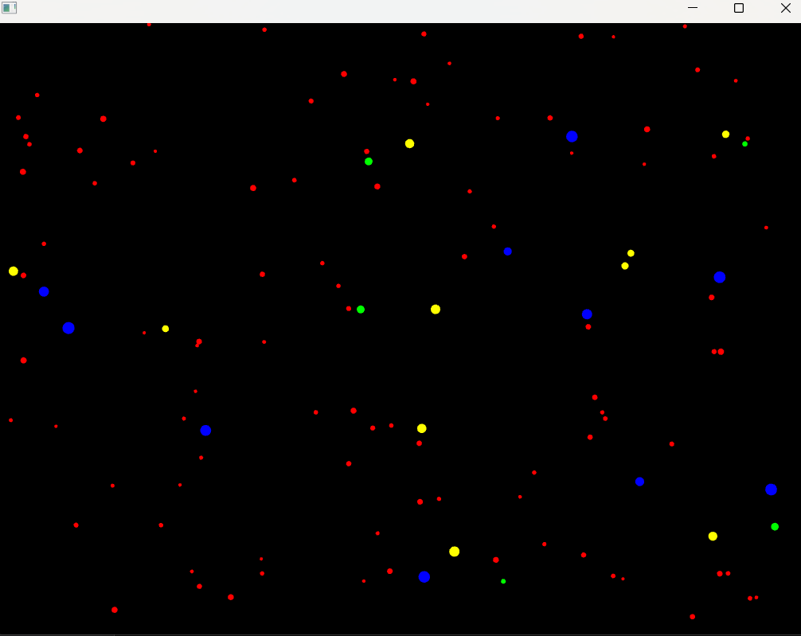
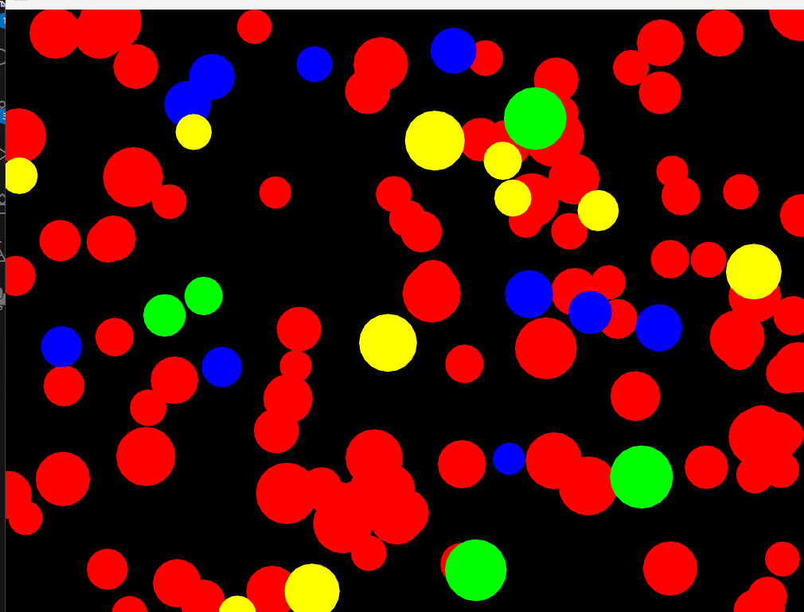

### Sesión 2


```c++
Particle* ParticleFactory::createParticle(const std::string& type) { 
	Particle* particle = new Particle(); // Crear una nueva partícula

	if (type == "star") { // Configurar propiedades específicas para una estrella
		particle->size = ofRandom(2, 4);  // Tamaño pequeño
		particle->color = ofColor(255, 0, 0); // Rojo
    }
    else if (type == "shooting_star") {
        particle->size = ofRandom(3, 6);
        particle->color = ofColor(0, 255, 0);
        particle->velocity *= 3;
    }
    else if (type == "planet") {
        particle->size = ofRandom(5, 8);
        particle->color = ofColor(0, 0, 255);
    }
    return particle;
}

```

 que cumpla la condición para que se genere la esfera.


- ¿Qué hace el patrón observer en este caso?

    R// Es el encargado de manejar los eventos, si estas suscrito te envía el evento y te lo notifica 

- ¿Qué hace el patrón factory en este caso?

    R// El patrón de diseño de la factoria no depende de una ubicación específica, es decir, puede estar en el Draw, en el set up o en una clase que cumpla la condición para que se genere la esfera. En este caso al presionar una tecla ocurre el evento de atrear, repeler o detener.

- ¿Qué hace el patrón state en este caso?

    R// El patrón state es una la maquina de estados de las partículas, determina si esta en el estado de atracción, el esatdo detenido. Cambiando de forma dinámica la logica de la particula.


Experimenta con el código y realiza algunas modificaciones para entender mejor su funcionamiento. Por ejemplo:

- Adiciona un nuevo tipo de partícula.

    R//


    ```c++
    void ofApp::setup() {

    for (int i = 0; i < 10; ++i) {
    Particle* p = ParticleFactory::createParticle("Yellowcomet");
    particles.push_back(p);
    addObserver(p);
    }

    ```


    ```c++
    Particle* ParticleFactory::createParticle(const std::string& type) {         

     else if (type == "Yellowcomet") {
     particle->size = ofRandom(4, 7);
     particle->color = ofColor(255, 255, 0); 
     particle->velocity *= 2;
    }

    ```


- Adiciona un nuevo estado.

    R// 


    ```c++
    void Mitosis::update(Particle* particle) {
    if (particle->size < 20.0f) { // Limita el tamaño máximo
        particle->size *= 2.0f;

    }

    
    ```


- Crea otros eventos para notificar a las partículas.

    R//

    ```c++
     else if (key == 'm') {
     notify("mitosis");
	}
    ```







