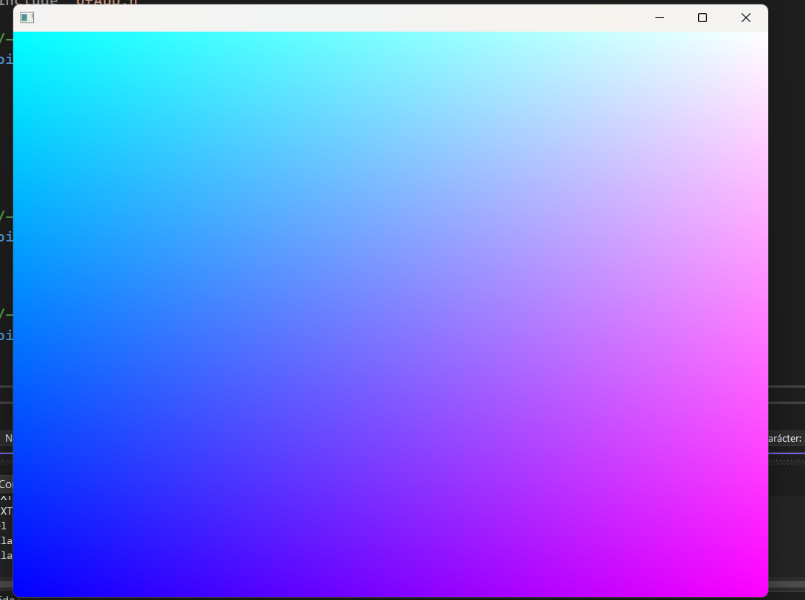
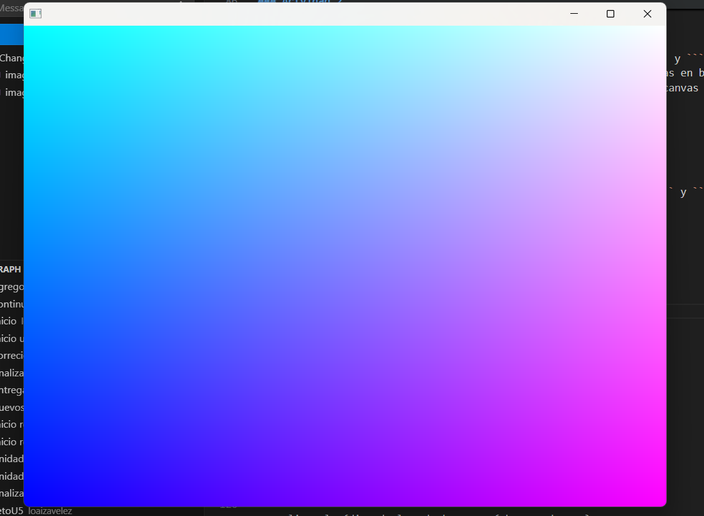
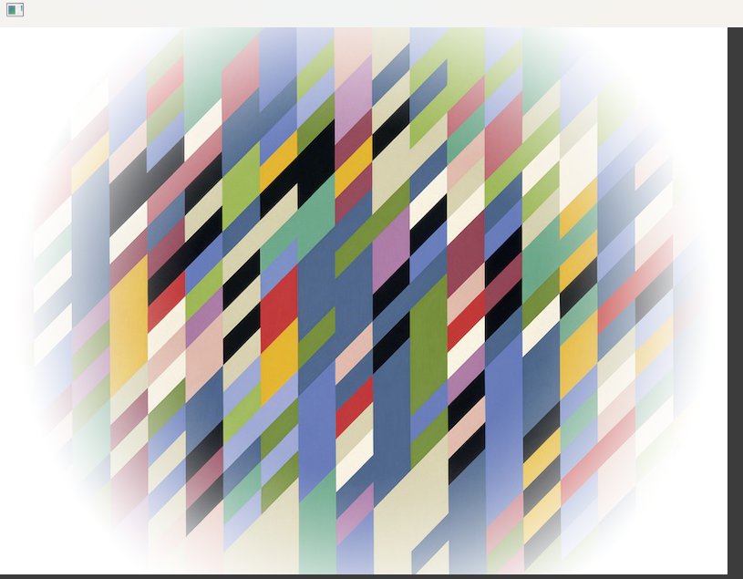

### Actividad 1

¿Cómo sacar el máximo de los videos educativos?


- Luego, de memoria, trata de listar los conceptos fundamentales y hacer un resumen de estos. Puedes también hacer diagramas o mapas conceptuales. Trata de conectar estos con conceptos que ya conoces.


    R// una GPU trabaja con información mucho más compleja, una CPU puede trabajar con esa información siempre y cuando no sea demasiada, es decir, puedes usar la CPU, hace lo mismo, usando el ejemplo del avión, puedes llevar varios tipos de datos, la analogía era con maletas, pasajeros, bolsas de mano y así, sin emabrgo, la GPU es un barco carguero, puede almacenar muchisima información, pero es más lento, asi que, para optimizar lo vale la penas usar la GPU para pocos datos.


------------

- ¿Qué son los vértices?

    R// Son puntos en una figura geometrica, son las esquinas y se usan como referencia para darle forma al triángulo.

- ¿Con qué figura geométrica se dibuja en 3D?

    R// Triángulos.

- ¿Qué es un shader?

    R// Un shader, la traducción literal es sombreado, es lo que le da la apariencia al objeto de la escena, color, profofundiad y brillo.

- ¿Cómo se le llaman a los grupos de píxeles de un mismo triángulo?

    R// Fragments.

- ¿Qué es un fragment shader?

    R// Es el cálculo del color del píxel.

- ¿Qué es un vertex shader?

    R// El vertex shader es el encargado de interpretar la figura con los vertices, toma sus divisiones y asigna el color del pixel.

- ¿Al proceso de determinar qué pixels del display va a cubrir cada triángulo de una mesh se le llama?

    R// Rasterización 

- ¿Qué es el render pipeline?

    R// El render pipeline es la secuencia que se usa al transformar un espacio 3D en una foto 2D, con esta secuencia se aplica la iluminación y resto de efectos de la escena, cabe destacar que no se usa la fuente de la iluminación, ya que usaría una cantidad casi infinita de puntos de luz, se disparan los rayos de luz desde la camra y luego se reinterpretan del como se verían desde la fuente de luz. En esta fase se aplican la rasterización, fragment shader y la propia renderización de la escena.

- ¿Hay alguna diferencia entre aplicar un color a una superficie de una mesh o aplicar una textura?

    R// La diferencia esta en el mismo nombre, el color, es un color plano para todo el objeto, si pones un color verde a un plano, todo el plano tendra ese color, sin variaciones a menos que modifiques los atributos del color. Una textura es una imagen que debe ser configurada por un mapa UV, se aplican al objeto y dentro de este mapa se vera donde se aplicara esa textura.
    
    

- ¿Cuál es la diferencia entre una textura y un material?

    R// Tomando en cuenta la definición de textura, es una imagen que cumple la condición de simular un aspecto, ya sea rugoso, plano o liso. Un material tiene más características, tiene atributos como la iluminación, transparencia, refracción y brillo.

- ¿Qué transformaciones se requieren para mover un vértice del 3D world al View Screen?

    R// Desde la camara, se toma una foto 

- ¿Al proceso de convertir los triángulos en fragmentos se le llama?

    R// Rasterización, es el proceso encargado del comportamiento que determina que pixeles formaran parte de un triángulo, generando los fragmentos.

- ¿Qué es el framebuffer?

    R// El framebuffer es la imagen guardada en la GPU, se mueve la información de la imagen a este espacio durante la renderización,  guardando cada **fragments**, aquí se visualiza el color, el sombreado, la profunidad y la iluminación después de haber pasado por el pipeline.

- ¿Para qué se usa el Z-buffer o depth buffer en el render pipeline?

    R// se usa para determinar la profundidad de los fragmentos y organizar cuales van por delante y cuales van por detras, también determina si el fragmento es visible, con el ejemplo del tren, si no es visible estos fragmentos se van a borrar dependiendo de la perspectiva del observador.


### Actvidad 2


**Observa la salida.**

Luego de aplicar la modificación en las lineas ```shader.begin();``` y ```shader.end();``` el resultado luego de comentar ambas lineas, y de comentar unicamente una de ellas, es el mismo, un canvas en blanco. No se inicia el shader personalizado por lo tanto no se dibuja, encambio si comentas el ```shader.end();``` se ve un canvas medianamente rellenado por el color gris oscuro. 


 


Luego de revertir la modificación en las lineas ```shader.begin();``` y ```shader.end();```




- ¿Cómo funciona?

    R// Se cargan los shaders ```shader.load("shadersGL3/shader");``` y ```shader.load("shadersGL2/shader");```. dentro de la carpeta se encuentra el .vert y el . frag

- ¿Qué resultados obtuviste?

    R// Es un fondo azulado con tonos rosas y un degradado en el medio que es el limite entre los colores rosados y azules.
    
    

- ¿Estás usando un vertex shader?

    R// Si, esta dentro de este codigo:

    ```c++
    OF_GLSL_SHADER_HEADER

    uniform mat4 modelViewProjectionMatrix;

    in vec4 position;

    void main(){
	gl_Position = modelViewProjectionMatrix * position;
    }


    ```

    este es el que calcula la posición de cada pixel para dibujarlo.

- ¿Estás usando un fragment shader?

    R// Aquí se pinta el valor del pixel dentro la coordenada asignada.

    ```c++
        OF_GLSL_SHADER_HEADER

    out vec4 outputColor;

    void main()
    {
    // gl_FragCoord contains the window relative coordinate for the fragment.
    // we use gl_FragCoord.x position to control the red color value.
    // we use gl_FragCoord.y position to control the green color value.
    // please note that all r, g, b, a values are between 0 and 1.
    
    float windowWidth = 1024.0;
    float windowHeight = 768.0;
    
	float r = gl_FragCoord.x / windowWidth;
	float g = gl_FragCoord.y / windowHeight;
	float b = 1.0;
	float a = 1.0;
	outputColor = vec4(r, g, b, a);
    }


    ```

- Analiza el código de los shaders. ¿Qué hace cada uno?

    R//
    
    Calcula la posisicón del vertice para dibujarlo en esa posición.


     ```c++
        OF_GLSL_SHADER_HEADER

        uniform mat4 modelViewProjectionMatrix;

        in vec4 position;

        void main(){
	    gl_Position = modelViewProjectionMatrix * position;
        }


     ```

    
    El .frag rellena con el color la posición de los vertices.

    ```c++
        OF_GLSL_SHADER_HEADER

    out vec4 outputColor;

    void main()
    {
    // gl_FragCoord contains the window relative coordinate for the fragment.
    // we use gl_FragCoord.x position to control the red color value.
    // we use gl_FragCoord.y position to control the green color value.
    // please note that all r, g, b, a values are between 0 and 1.
    
    float windowWidth = 1024.0;
    float windowHeight = 768.0;
    
	float r = gl_FragCoord.x / windowWidth;
	float g = gl_FragCoord.y / windowHeight;
	float b = 1.0;
	float a = 1.0;
	outputColor = vec4(r, g, b, a);
    }


    ```

### Actvidad 3

- ¿Qué es un uniform?

    R// El uniform es una variable global que es delcara dentro del OpenFramworks, su valor es **constante** y debe ser aplicada en todos los vertices del canvas durante la ejecución de la función Draw() en una sola pasada. Dentro de la actividad 2 un uniform es la función **shader.begin/end()**.

- ¿Cómo funciona el código de aplicación, los shaders y cómo se comunican estos?

    R// El primer paso es cargar los shader con el shader.load, toma los colores del RGB y su comportamiento, luego son cargados con el shader.begin() y luego se cierra con el shader.end, en este proceso se usa la pisición del .vert y se rellena con el   .frag proyectando la imagen. 


### Actividad 4

- ¿Qué hace el código del ejemplo?

    R// Es un canvas con un cuadrado que se deforma según la posición del mouse, formando u a figura esferica y cambia de color según la posición en el eje horizontal del mouse, de azul a rosa.

- ¿Cómo funciona el código de aplicación, los shaders y cómo se comunican estos?

    R// Usando los Uniforms con la posición del mouse, una longitud del mouse se le asigna un rango de color dependiendo de la posición

- Realiza modificaciones a ofApp.cpp y al vertex shader para conseguir otros comportamientos.

    R//

- Realiza modificaciones al fragment shader para conseguir otros comportamientos.

    R//


## Ejemplos OF

### Ejemplo 2, actividad 3

**.vert**

```c++
OF_GLSL_SHADER_HEADER

// these are for the programmable pipeline system
uniform mat4 modelViewProjectionMatrix;
in vec4 position;

// the time value is passed into the shader by the OF app.
uniform float time;


void main()
{
    // the sine wave travels along the x-axis (across the screen),
    // so we use the x coordinate of each vertex for the calculation,
    // but we displace all the vertex along the y axis (up the screen)/
    float displacementHeight = 100.0;
    float displacementY = sin(time + (position.x / 100.0)) * displacementHeight;
	
    vec4 modifiedPosition = modelViewProjectionMatrix * position;
	modifiedPosition.y += displacementY;
	gl_Position = modifiedPosition;
}

```
**.frag**

```c++
OF_GLSL_SHADER_HEADER

uniform vec4 globalColor;

out vec4 outputColor;
 
void main()
{
    outputColor = globalColor;
}

```
En este ejemplo se puede ver la inclusión se los Uniform, el valor constante del uniform es declarado en el .vert como un float time. Se usan para el comportamiento de las animaciones. Se actualiza cada frame permitiendo el movimiento de los vertices de forma vertical. 


### Ejemplo 3, actividad 4 


```c++

OF_GLSL_SHADER_HEADER

// these are for the programmable pipeline system
uniform mat4 modelViewProjectionMatrix;
in vec4 position;

uniform float mouseRange;
uniform vec2 mousePos;
uniform vec4 mouseColor;

void main()
{
    // copy position so we can work with it.
    vec4 pos = position;
    
    // direction vector from mouse position to vertex position.
	vec2 dir = pos.xy - mousePos;
    
    // distance between the mouse position and vertex position.
	float dist =  sqrt(dir.x * dir.x + dir.y * dir.y);
    
    // check vertex is within mouse range.
	if(dist > 0.0 && dist < mouseRange) {
		
		// normalise distance between 0 and 1.
		float distNorm = dist / mouseRange;
        
		// flip it so the closer we are the greater the repulsion.
		distNorm = 1.0 - distNorm;
		
        // make the direction vector magnitude fade out the further it gets from mouse position.
        dir *= distNorm;
        
		// add the direction vector to the vertex position.
		pos.x += dir.x;
		pos.y += dir.y;
	}

	// finally set the pos to be that actual position rendered
	gl_Position = modelViewProjectionMatrix * pos;
}

```


```c++
OF_GLSL_SHADER_HEADER

out vec4 outputColor;

uniform vec4 mouseColor;
 
void main()
{
    outputColor = mouseColor;
}


```


### Ejemplo 4, texturas 


```c++
OF_GLSL_SHADER_HEADER

// these are for the programmable pipeline system and are passed in
// by default from OpenFrameworks
uniform mat4 modelViewProjectionMatrix;

in vec4 position;
in vec2 texcoord;

// this is something we're creating for this shader
out vec2 texCoordVarying;

// this is coming from our C++ code
uniform float mouseX;

void main()
{
    // here we move the texture coordinates
    texCoordVarying = vec2(texcoord.x + mouseX, texcoord.y);

    // send the vertices to the fragment shader
	gl_Position = modelViewProjectionMatrix * position;
}


```
se usa el uniform de la posición del mouse para actualizar la posición de los vectores, se usa el ```uniform mat4 modelViewProjectionMatrix;``` luego el uniform flotante del mousex se envia al textcoordvarying que sus datos de saalida son el mover la textura.

```c++
OF_GLSL_SHADER_HEADER

// this is how we receive the texture
uniform sampler2D tex0;
uniform vec2 resolution;

in vec2 texCoordVarying;

out vec4 outputColor;
 
void main()
{
    outputColor = texture(tex0, texCoordVarying / resolution);
}


```


### Ejemplo 5, Masking

**.vert**

```c++
OF_GLSL_SHADER_HEADER

// these are for the programmable pipeline system
uniform mat4 modelViewProjectionMatrix;

in vec4 position;
in vec2 texcoord;

out vec2 texCoordVarying;

void main()
{
    texCoordVarying = texcoord;
    
	gl_Position = modelViewProjectionMatrix * position;
}


```


**.frag**


```c++
OF_GLSL_SHADER_HEADER

uniform sampler2D tex0;
uniform sampler2D imageMask;

in vec2 texCoordVarying;

out vec4 outputColor;

void main()
{
    vec4 texel0 = texture(tex0, texCoordVarying);
    vec4 texel1 = texture(imageMask, texCoordVarying);
    outputColor = vec4(texel0.rgb, texel0.a * texel1.a);
}

```


