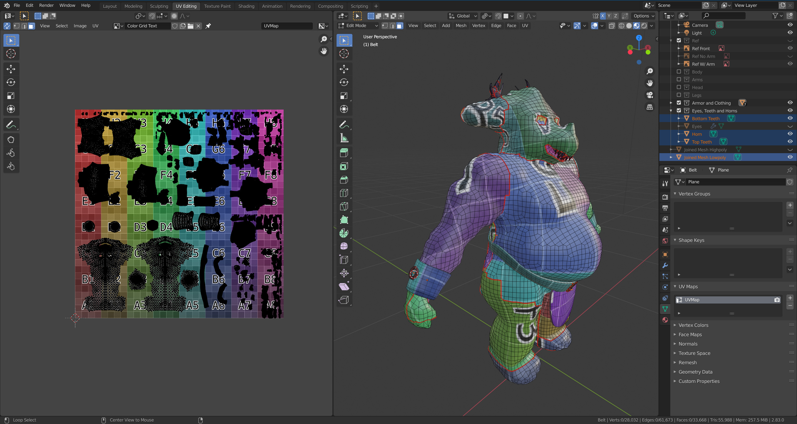

### Actividad 1

¿Cómo sacar el máximo de los videos educativos?


- Luego, de memoria, trata de listar los conceptos fundamentales y hacer un resumen de estos. Puedes también hacer diagramas o mapas conceptuales. Trata de conectar estos con conceptos que ya conoces.


    R// una GPU trabaja con información mucho más compleja, una CPU puede trabajar con esa información siempre y cuando no sea demasiada, es decir, puedes usar la CPU, hace lo mismo, usando el ejemplo del avión, puedes llevar varios tipos de datos, la analogía era con maletas, pasajeros, bolsas de mano y así, sin emabrgo, la GPU es un barco carguero, puede almacenar muchisima información, pero es más lento, asi que, para optimizar lo vale la penas usar la GPU para pocos datos.


------------

- ¿Qué son los vértices?

    R// Son puntos en una figura geometrica, son las esquinas y se usan como referencia para darle forma al triángulo.

- ¿Con qué figura geométrica se dibuja en 3D?

    R// Triángulos.

- ¿Qué es un shader?

    R// Un shader, la traducción literal es sombreado, es lo que le da la apariencia al objeto de la escena, color, profofundiad y brillo.

- ¿Cómo se le llaman a los grupos de píxeles de un mismo triángulo?

    R// Fragments.

- ¿Qué es un fragment shader?

    R// Es el cálculo del color del píxel.

- ¿Qué es un vertex shader?

    R// El vertex shader es el encargado de interpretar la figura con los vertices, toma sus divisiones y asigna el color del pixel.

- ¿Al proceso de determinar qué pixels del display va a cubrir cada triángulo de una mesh se le llama?

    R// Rasterización 

- ¿Qué es el render pipeline?

    R// El render pipeline es la secuencia que se usa al transformar un espacio 3D en una foto 2D, con esta secuencia se aplica la iluminación y resto de efectos de la escena, cabe destacar que no se usa la fuente de la iluminación, ya que usaría una cantidad casi infinita de puntos de luz, se disparan los rayos de luz desde la camra y luego se reinterpretan del como se verían desde la fuente de luz. En esta fase se aplican la rasterización, fragment shader y la propia renderización de la escena.

- ¿Hay alguna diferencia entre aplicar un color a una superficie de una mesh o aplicar una textura?

    R// La diferencia esta en el mismo nombre, el color, es un color plano para todo el objeto, si pones un color verde a un plano, todo el plano tendra ese color, sin variaciones a menos que modifiques los atributos del color. Una textura es una imagen que debe ser configurada por un mapa UV, se aplican al objeto y dentro de este mapa se vera donde se aplicara esa textura.
    
    

- ¿Cuál es la diferencia entre una textura y un material?

    R// Tomando en cuenta la definición de textura, es una imagen que cumple la condición de simular un aspecto, ya sea rugoso, plano o liso. Un material tiene más características, tiene atributos como la iluminación, transparencia, refracción y brillo.

- ¿Qué transformaciones se requieren para mover un vértice del 3D world al View Screen?

    R// Desde la camara, se toma una foto 

- ¿Al proceso de convertir los triángulos en fragmentos se le llama?

    R// Rasterización, es el proceso encargado del comportamiento que determina que pixeles formaran parte de un triángulo, generando los fragmentos.

- ¿Qué es el framebuffer?

    R// El framebuffer es la imagen guardada en la GPU, se mueve la información de la imagen a este espacio durante la renderización,  guardando cada **fragments**, aquí se visualiza el color, el sombreado, la profunidad y la iluminación después de haber pasado por el pipeline.

- ¿Para qué se usa el Z-buffer o depth buffer en el render pipeline?

    R// se usa para determinar la profundidad de los fragmentos y organizar cuales van por delante y cuales van por detras, también determina si el fragmento es visible, con el ejemplo del tren, si no es visible estos fragmentos se van a borrar dependiendo de la perspectiva del observador.


### Actvidad 2


**Observa la salida.**

Luego de aplicar la modificación en las lineas ```shader.begin();``` y ```shader.end();```

 


- ¿Cómo funciona?

    R//

- ¿Qué resultados obtuviste?

    R// 

- ¿Estás usando un vertex shader?

    R//

- ¿Estás usando un fragment shader?

    R//

- Analiza el código de los shaders. ¿Qué hace cada uno?

    R//

### Actvidad 3

- ¿Qué es un uniform?

    R//

- ¿Cómo funciona el código de aplicación, los shaders y cómo se comunican estos?

    R//


### Actividad 4

- ¿Qué hace el código del ejemplo?

    R//

- ¿Cómo funciona el código de aplicación, los shaders y cómo se comunican estos?

    R//

- Realiza modificaciones a ofApp.cpp y al vertex shader para conseguir otros comportamientos.

    R//

- Realiza modificaciones al fragment shader para conseguir otros comportamientos.

    R//