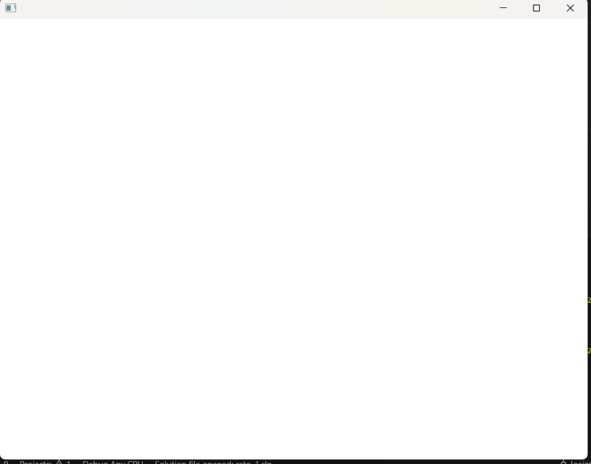

### Actividad 1

- ¿Qué son los vértices?

    R// Son puntos en una figura geometrica, se puede decir que las esquinas 

- ¿Con qué figura geométrica se dibuja en 3D?

    R// Triángulos y polígonos.

- ¿Qué es un shader?

    R//

- ¿Cómo se le llaman a los grupos de píxeles de un mismo triángulo?

    R//

- ¿Qué es un fragment shader?

    R//

- ¿Qué es un vertex shader?

    R//

- ¿Al proceso de determinar qué pixels del display va a cubrir cada triángulo de una mesh se le llama?

    R//

- ¿Qué es el render pipeline?

    R//

- ¿Hay alguna diferencia entre aplicar un color a una superficie de una mesh o aplicar una textura?

- ¿Cuál es la diferencia entre una textura y un material?

- ¿Qué transformaciones se requieren para mover un vértice del 3D world al View Screen?

- ¿Al proceso de convertir los triángulos en fragmentos se le llama?

- ¿Qué es el framebuffer?

- ¿Para qué se usa el Z-buffer o depth buffer en el render pipeline?


### Actvidad 2


**Observa la salida.**

Luego de aplicar la modificación en las lineas ```shader.begin();``` y ```shader.end();```

 


- ¿Cómo funciona?

    R//

- ¿Qué resultados obtuviste?

    R// 

- ¿Estás usando un vertex shader?

    R//

- ¿Estás usando un fragment shader?

    R//

- Analiza el código de los shaders. ¿Qué hace cada uno?

    R//

### Actvidad 3

- ¿Qué es un uniform?

    R//

- ¿Cómo funciona el código de aplicación, los shaders y cómo se comunican estos?

    R//


### Actividad 4

- ¿Qué hace el código del ejemplo?

    R//

- ¿Cómo funciona el código de aplicación, los shaders y cómo se comunican estos?

    R//

- Realiza modificaciones a ofApp.cpp y al vertex shader para conseguir otros comportamientos.

    R//

- Realiza modificaciones al fragment shader para conseguir otros comportamientos.

    R//