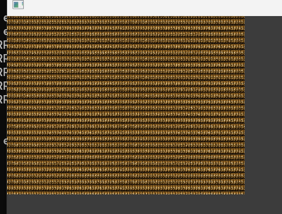
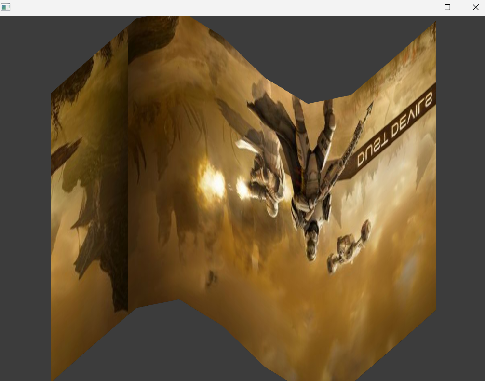

### OfApp 

Para esta actividad se usaran de referencia los siguientes ejemplos, 2,3,4 y el 6, el ejemplo a modificar es el número , se implementaran las funciones de todos los ejemplos mencionados en el .

```cpp
#include "ofApp.h"

//--------------------------------------------------------------
void ofApp::setup() {
	ofDisableArbTex();
	if(ofIsGLProgrammableRenderer()){
		shader.load("shadersGL3/shader");
	}else{
		shader.load("shadersGL2/shader");
	}

	if(img.load("img.jpg")) {
		img.getTexture().setTextureWrap(GL_REPEAT, GL_REPEAT);
	}

	plane.set(800, 600, 10, 10);
	plane.mapTexCoords(0, 0, img.getWidth(), img.getHeight());
}


//--------------------------------------------------------------
void ofApp::update() {
	
}

//--------------------------------------------------------------
void ofApp::draw() {
	
	// bind our texture. in our shader this will now be tex0 by default
	// so we can just go ahead and access it there.
	img.getTexture().bind();
	
	// start our shader, in our OpenGL3 shader this will automagically set
	// up a lot of matrices that we want for figuring out the texture matrix
	// and the modelView matrix
	shader.begin();


	
	// get mouse position relative to center of screen
	float mousePosition = ofMap(mouseX, 0, ofGetWidth(), 1.0, -1.0, true);
	mousePosition *= plane.getWidth();

	shader.setUniform1f("mouseX", mousePosition);
	shader.setUniform2f("resolution", ofGetWidth(), ofGetHeight()); 
	ofPushMatrix();
	ofTranslate(ofGetWidth()/2, ofGetHeight()/2);
	
	plane.draw();

	ofPopMatrix();
	
	shader.end();

	img.getTexture().unbind();
	
}

//--------------------------------------------------------------
void ofApp::keyPressed(int key){
	
}

//--------------------------------------------------------------
void ofApp::keyReleased(int key){

}

//--------------------------------------------------------------
void ofApp::mouseMoved(int x, int y){
	
}

//--------------------------------------------------------------
void ofApp::mouseDragged(int x, int y, int button){

}

//--------------------------------------------------------------
void ofApp::mousePressed(int x, int y, int button){

}

//--------------------------------------------------------------
void ofApp::mouseReleased(int x, int y, int button){

}

//--------------------------------------------------------------
void ofApp::windowResized(int w, int h){

}

//--------------------------------------------------------------
void ofApp::gotMessage(ofMessage msg){

}

//--------------------------------------------------------------
void ofApp::dragEvent(ofDragInfo dragInfo){ 

}


```


```cpp
OF_GLSL_SHADER_HEADER

// Uniformes
uniform mat4 modelViewProjectionMatrix;
uniform float time;
uniform float mouseRange;
uniform vec2 mousePos;
uniform vec4 mouseColor;
uniform float mouseX; 


in vec4 position;
in vec2 texcoord;
in vec4 color;

// Salidas
out vec2 texCoordVarying;
out vec4 globalColor;

void main()
{
    // Movimiento seno simple en Y
    float displacementHeight = 100.0;
    float displacementY = sin(time + (position.x / 100.0)) * displacementHeight;

    vec4 pos = position;
    pos.y += displacementY;

    // Deformación por proximidad al mouse
    vec2 dir = pos.xy - mousePos;
    float dist = length(dir);

    if(dist > 0.0 && dist < mouseRange) {
        float distNorm = 1.0 - dist / mouseRange;
        dir *= distNorm;
        pos.xy += dir;
    }

    // Transformación final
    gl_Position = modelViewProjectionMatrix * pos;

    // Coordenadas de textura desplazadas por mouseX
    texCoordVarying = vec2(texcoord.x + mouseX, texcoord.y);

    // Color para el fragment shader
    globalColor = color;
}
```



